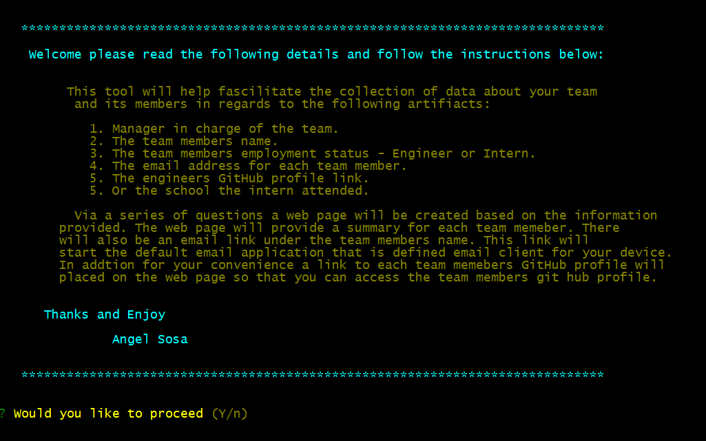
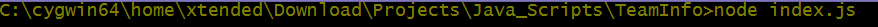
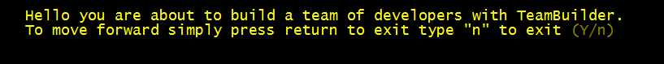
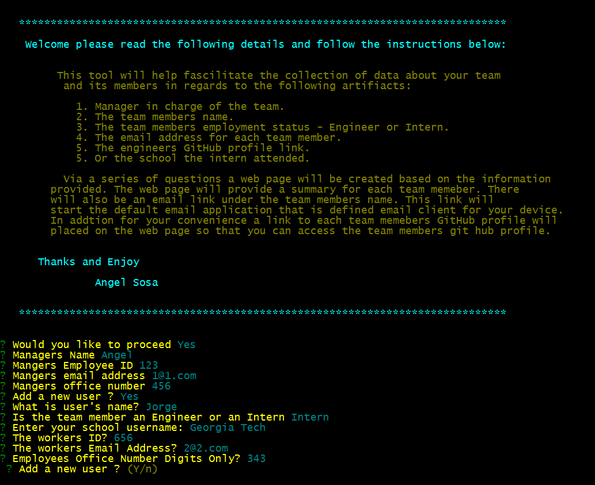

#  TeamInfoBuilder
Team Info Builder 
  
  
  Please use the following link to see published version of this repository https://xtended99.github.io/TeamInfoBuilder/  
  
  The home for this project lives at the following link at GitHub https://github.com/Xtended99/TeamInfoBuilder   
  
  To install from github all you have to do is the following   
  
    git clone git@github.com:Xtended99/TeamInfoBuilder.git   
    cd TeamInfoBuilder   
    npm install   
  
  To run the utility   

    node index.js   
  
    From there just follow the prompts.   
  
  ## Please Read this carefully!!! A very important note:   
  
    After you have entered one or many employees, After the last employtee you will be asked   
  
    1. ? Would you like to run this again? (Y/n)
       If you say "Y" at both prompts you will overwright your data and you will need to enter your 
    information again   
  
    2. There is an issue when you run "npm start" as opposed to "node index.js"
       The tool will break at the end when you run "npm start". Please run "node index.js"
  
   
  
    Please select NO or it will ovewrite your previous answers.   
    To see the compiled HTML please point your browser to the dist directory   
    and pick the index.html   
  
   In order to test you must run the tool once.   
   The test commands are   
         npm run test   
  
   
   
   
     
  This assignment is to create a tool that can auto generate a index.html file based on a set of predetermined questions.  
  There is a video link above and below for show and tell
     
   

  This is test the video
   
  
### Given:
  
Your task is to build a Node.js command-line application that takes in information about employees on a software   
engineering team, then generates an HTML webpage that displays summaries for each person. Testing is key to making   
code maintainable, so you’ll also write a unit test for every part of your code and ensure that it passes each test.  
  
Because this application won’t be deployed, you’ll need to provide a link to a walkthrough video that demonstrates  
its functionality and all of the tests passing. You’ll need to submit a link to the video AND add it to the readme of your project.
  
**Note**: There is no starter code for this assignment.
     
-   The application will be invoked by using the following command:   
   
-   node index.js   
   
-   Because this application won’t be deployed, you’ll also need to provide a link to a walkthrough video that   
-   demonstrates its functionality. Revisit the Screencastify Tutorial in the prework as a refresher on how to   
-   record video from your computer. You’ll need to submit a link to the video _and_ add it to the README of your project.   
   
   
### Experience the user should expect - User Story:   
   
- AS A manager I WANT to generate a webpage that displays my team's basic info SO THAT I have quick access to their emails and GitHub profiles  
    
### Website incorporated feature sets and expectations - Acceptance Criteria:  
  
- GIVEN a command-line application that accepts user input  
- WHEN I am prompted for my team members and their information  
- THEN an HTML file is generated that displays a nicely formatted team roster based on user input  
- WHEN I click on an email address in the HTML  
- THEN my default email program opens and populates the TO field of the email with the address  
- WHEN I click on the GitHub username  
- THEN that GitHub profile opens in a new tab  
- WHEN I start the application  
- THEN I am prompted to enter the team manager’s name, employee ID, email address, and office number  
- WHEN I enter the team manager’s name, employee ID, email address, and office number  
- THEN I am presented with a menu with the option to add an engineer or an intern or to finish building my team  
- WHEN I select the engineer option  
- THEN I am prompted to enter the engineer’s name, ID, email, and GitHub username, and I am taken back to the menu  
- WHEN I select the intern option  
- THEN I am prompted to enter the intern’s name, ID, email, and school, and I am taken back to the menu  
- WHEN I decide to finish building my team  
- THEN I exit the application, and the HTML is generated  
  
### HTML Generation:  
  
- All of the user relate html is generated by index.js according to the number employess added. 
- There is first half HTML and last half html that are used as templates. 

### Starting TeamInfoBuilder:  

   
  
### Very First Prompt:  
  
   
  
### Detailed Instructions Prompt:  
  
   
  
### User Details:  
  
   

### Sample index.html:  

[Sample Index.html](./index.html)
  
### Thank You:  
    And Enjoy
    
### Angel Sosa
  
